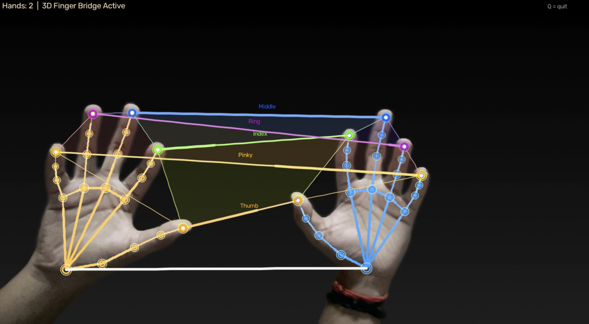
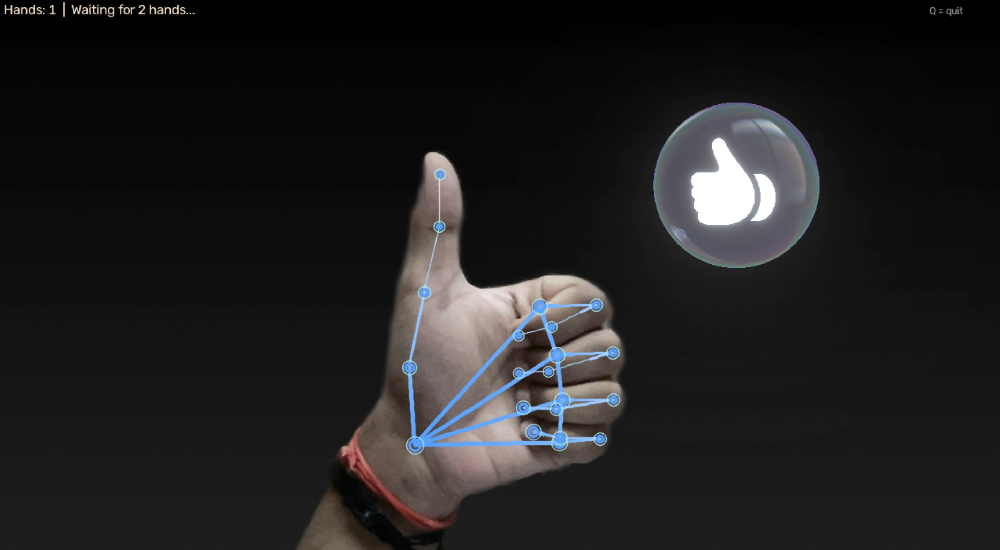
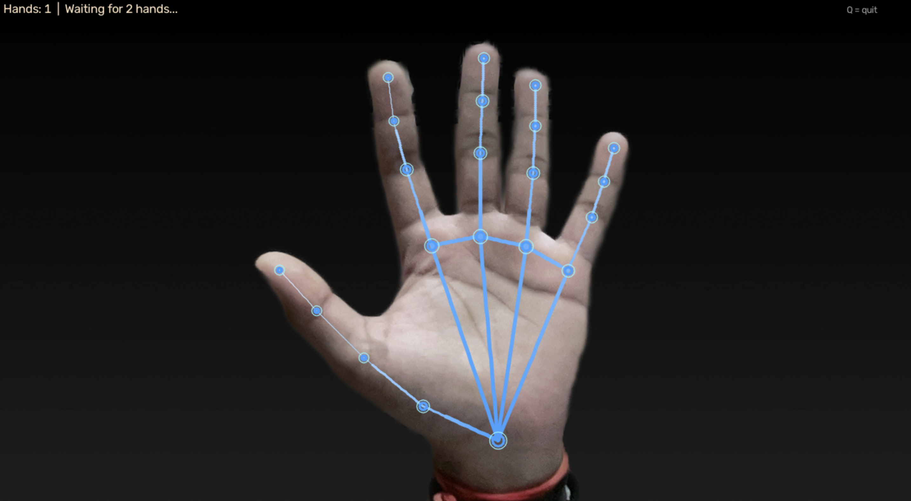

# 🤖 Hand Landmark Detection using MediaPipe and OpenCV

A real-time computer vision project that detects and visualizes **21 hand landmarks** using Google's **MediaPipe Hand Landmarker** and **OpenCV**.

---

## 📸 Project Demo

### Two-Hand Bridge Visualization



---

## 📷 More Examples

### 👍 Gesture Detection



### ✋ Single Hand Detection



---

## ✨ Features

- Real-time hand landmark detection
- Detects up to two hands simultaneously
- Tracks 21 landmarks for each hand
- Custom 3D-style visualization
- Interactive finger bridge connections
- Real-time webcam processing

---

## 🛠️ Technologies Used

- Python
- OpenCV
- MediaPipe
- NumPy

---

## 🚀 Installation

Clone the repository:

```bash
git clone https://github.com/krishna03-23-085/hand-landmark-detection.git
```

Install dependencies:

```bash
pip install -r requirements.txt
```

Run the project:

```bash
python main.py
```

---

## 👨‍💻 Author

**Krishna Singh**
